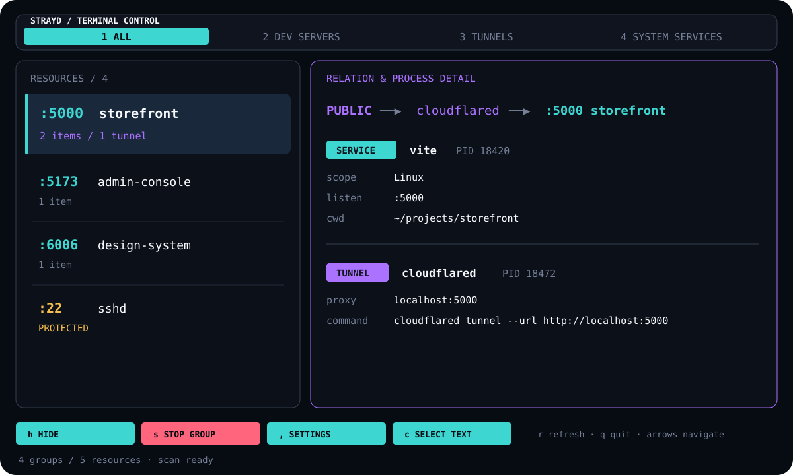
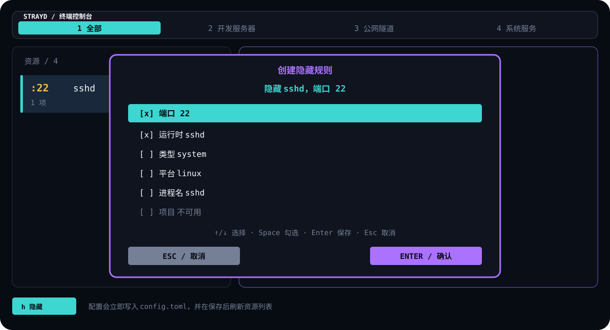
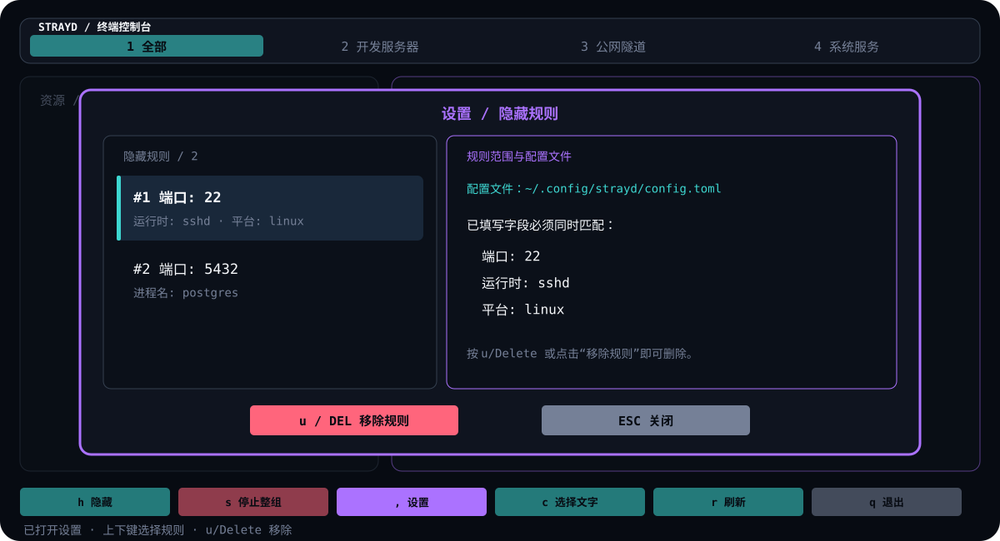
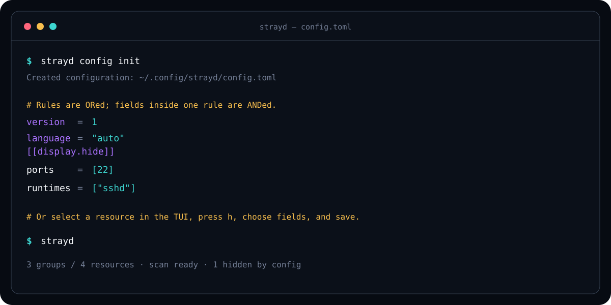

# Strayd

[](https://www.npmjs.com/package/strayd)
[](https://github.com/MarioJames/strayd/actions/workflows/build-npm.yml)
[](LICENSE)

Strayd 是一个通过 npm 分发的跨平台 Rust TUI/CLI，用来发现、关联和停止散落在本机上的开发服务与临时公网隧道。

<p align="center">
  
</p>

## 它解决什么

开发服务器和临时隧道经常由不同终端、IDE 或后台任务启动。端口还在监听，但原始终端早已找不到；看到一个进程时，又无法判断它是否正在承载别的服务。

Strayd 会：

- 识别 Next.js、Vite、Nuxt、Astro、SvelteKit、Remix、Angular、Storybook、Webpack、Rspack、Parcel、Node.js、Bun 和 Deno 服务。
- 识别 Cloudflare Quick Tunnel、ngrok、SSH 反向转发、frp、localtunnel 和 bore。
- 解析隧道的本地目标，把隧道与对应端口的源服务放进同一组。
- 支持只停开发服务、只停隧道，或按依赖顺序停止整个关联组。
- 展示并保护 `sshd`，避免误关远程入口。
- 根据当前系统自动使用 Windows、Linux/WSL 或 macOS 的原生探测与终止方式。
- 内置简体中文与英文界面，按系统语言自动选择，并在中性 locale 下使用时区兜底。

## 安装

要求 Node.js 18 或更高版本；不需要安装 Rust。

```bash
npm install --global strayd
strayd
```

也可以不安装直接体验：

```bash
npx strayd
```

支持以下原生组合：

- Linux x64 / arm64，包括 WSL
- Windows x64 / arm64
- macOS Intel / Apple Silicon

## TUI 操作

启动后左侧是资源组，右侧展示端口、进程、创建时间、运行时长、工作目录以及隧道到源服务的关联链路。创建时间按本机时区显示并标明 UTC 偏移；运行时长显示为 `HH:MM:SS`，超过一天时附带天数，界面重绘时自动更新。读取不到时间时显示“未知”。`strayd list` 同样展示时间，JSON 输出中的 `startedAt` 为 Unix 秒（不可用时为 `null`）。所有停止操作都需要再次确认。

展示名按以下来源选择，列表、详情、关联链路与 CLI 使用同一结果：

- macOS `.app` 中的主程序或辅助进程使用外层应用名，例如“测试播放器”“Strayd Test Desk”。
- 开发框架使用项目目录名；Node、Python、Java、.NET 等解释器优先识别明确的脚本、模块、JAR 或包名，通用的 `server` / `index` 入口回退到项目目录。
- 普通二进制、系统服务和隧道使用可执行文件名，避免启动目录覆盖 `fixture-agent`、`nginx` 或 `cloudflared` 的名称。
- 推导项目目录时跳过 `bin`、构建输出、虚拟环境等通用目录；用户主目录、系统根目录及共享根目录不作为项目名。无法确定时回退到可执行文件名、系统进程名或 PID。

命名使用系统提供的结构化参数，不按空格拆分命令；未知的解释器选项不会把后续参数猜成脚本名。JSON 的 `displayName` 是展示名，`processName` 保留系统原始进程名，右侧也单独列出进程名。扫描覆盖所有 TCP 监听进程，因此有监听端口的桌面应用也会出现在“全部”分类中。

| 操作 | 键盘 | 鼠标 |
| --- | --- | --- |
| 切换分类 | `←/→`、`Tab`、`Shift+Tab`、`1-4` | 点击顶部完整分类区域 |
| 选择资源组 | `↑/↓`、`j/k`、`Home/End` | 点击资源行或滚轮 |
| 滚动右侧详情 | `PageUp` / `PageDown` | 在详情区滚轮 |
| 创建隐藏规则 | `h` | 点击 `HIDE` / `隐藏` |
| 勾选规则字段 | `Space` | 点击字段行 |
| 打开 Settings | `,` | 点击 `SETTINGS` / `设置` |
| 选择 / 移除隐藏规则 | `↑/↓`，`u` / `Delete` | 点击规则，再点击 `REMOVE RULE` / `移除规则` |
| 停止当前范围 | `s` | 点击随分类变化的 `STOP…` / `停止…` |
| 复制命令 | — | 点击命令下方的 `COPY COMMAND` / `复制命令` 色块 |
| 选择右侧文字 | `c`，再次按 `c` / `Esc` 返回 | 点击 `SELECT TEXT` / `选择文字` 后直接拖选 |
| 刷新 / 退出 | `r` / `q` | 点击 `REFRESH` / `QUIT` |
| 确认 / 取消 | `Enter` / `Esc` | 点击确认框按钮 |

TUI 只保留一个停止入口，作用范围由当前分类明确决定：`全部` 停止整个关联组，`开发服务器` 只停止开发服务，`公网隧道` 只停止隧道，`系统服务` 只停止可终止的系统服务。确认框会再次显示实际类型和进程数量。CLI 仍保留 `dev`、`tunnel`、`system`、`group`、`resource` 等精细目标。

进入“选择文字”后，Strayd 会暂时释放终端鼠标并暂停界面重绘，此时右侧详情可以像普通终端输出一样直接拖选复制；按 `c` 或 `Esc` 恢复点击操作。

命令会在右侧详情区按终端宽度完整换行，不会用省略号截断。点击命令下方的纯色复制按钮，会通过 OSC 52 把原始完整命令写入终端剪贴板；该功能需要当前终端支持并允许 OSC 52。

## 持久化配置

Strayd 可以直接在 TUI 中维护隐藏规则：选中一个资源后按 `h`，勾选作为匹配条件的字段并保存；默认选择“端口 + 运行时”。按 `,` 或点击底部 `Settings / 设置` 打开弹窗，即可查看并移除自己添加的规则。修改会立即写入配置文件并刷新界面。

<p align="center">
  
</p>

<p align="center">
  
</p>

也可以直接维护 TOML。先生成带注释的模板：

```bash
strayd config init
strayd config path
strayd config show
```

配置位置遵循系统约定：

- Linux/WSL：`$XDG_CONFIG_HOME/strayd/config.toml`，默认是 `~/.config/strayd/config.toml`
- macOS：`~/Library/Application Support/strayd/config.toml`
- Windows：`%APPDATA%\strayd\config.toml`

例如，只隐藏监听 22 端口的 `sshd`，但不会隐藏同组中代理该端口的隧道：

```toml
version = 1
language = "auto"

[[display.hide]]
ports = [22]
runtimes = ["sshd"]
```

<p align="center">
  
</p>

每条 `[[display.hide]]` 都是一条独立规则。规则之间是 OR；同一规则中填写的字段是 AND；同一数组内任意值匹配即可。空规则不会隐藏任何内容。

| 字段 | 匹配方式 |
| --- | --- |
| `ports` | 监听端口或隧道本地目标端口 |
| `runtimes` | 运行时名称，如 `sshd`、`vite`、`cloudflared` |
| `kinds` | `dev`、`tunnel`、`system`、`other` |
| `platforms` | `windows`、`linux`、`macos` |
| `process_names` | 进程名，忽略大小写的包含匹配 |
| `projects` | 项目名或工作目录，忽略大小写的包含匹配 |
| `commands` | 完整命令行，忽略大小写的包含匹配 |
| `ids` | Strayd 资源 ID，忽略大小写的精确匹配 |

规则同时作用于 TUI、`list` 和 `stop`。临时绕过配置可使用 `--no-config`；此时 Settings 弹窗为只读。指定其他文件可使用 `--config <PATH>`：

```bash
strayd --no-config
strayd --config ./team-strayd.toml list
```

## 语言

`language = "auto"` 会优先读取系统 locale；`C`、`POSIX` 等中性 locale 再通过系统时区判断，仍无法判断时使用英文。配置和命令行都可以显式固定语言：

```toml
language = "zh-cn" # 或 "en"
```

```bash
strayd --language zh-cn
strayd --language en
strayd --language auto
```

优先级为 `--language` > 配置文件 > 系统语言/时区。JSON 字段、命令名、筛选参数和运行时标识保持不变，便于脚本稳定使用。

## CLI

无子命令时默认进入 TUI。脚本和自动化场景可以使用：

```bash
strayd list
strayd --language en list
strayd list --kind tunnel --json
strayd list --platform linux --port 5000
strayd stop tunnel --port 5000 --dry-run
strayd stop tunnel --port 5000 --yes
strayd stop system --port 8080 --yes
strayd stop group --port 5000 --yes
strayd stop dev --project storefront --all --yes
```

`list` 与 `stop` 支持 `--id`、`--port/-p`、`--project`、`--platform windows|linux|macos` 和 `--runtime`。停止命令匹配多项时必须显式传入 `--all`；实际关闭前需要交互确认或传入 `--yes`，`--dry-run` 只打印计划。

## 平台行为与安全边界

- Linux/WSL：读取 Linux 端口和进程；systemd 托管服务会尝试停止对应 unit。
- Windows：读取 Windows 原生端口和进程，并通过 `taskkill /T /F` 结束进程树。
- macOS：读取 macOS 原生端口和进程，先发送 `TERM`，必要时再发送 `KILL`。
- 每次停止前都会复核 PID 与进程启动标识，避免 PID 被复用后误杀新进程。
- 包含受保护资源的组拒绝整组停止；`sshd` 始终不可由 Strayd 终止。
- 部分系统进程的端口或命令行受操作系统权限限制。Strayd 只展示当前用户可读取的信息，不主动提权。

## 本地开发

```bash
bun install
bun install --frozen-lockfile
bun run test
bun run check
bun run pack:cli
```

`bun run pack:cli` 只装箱当前宿主的二进制。完整 npm 包由 [build-npm.yml](.github/workflows/build-npm.yml) 在六种原生 runner 上分别构建、测试并统一装箱。

真实进程、PTY、容器、安装包、故障清理和 CI 的运行方式见[测试环境](docs/testing-environment.md)。快速运行：`bun scripts/test-env.ts run --suite native,tui,runtime-smoke,faults,replay`；原生 macOS/Windows 与可选系统专项的验证边界在文档中单列。

## License

[MIT](LICENSE)
