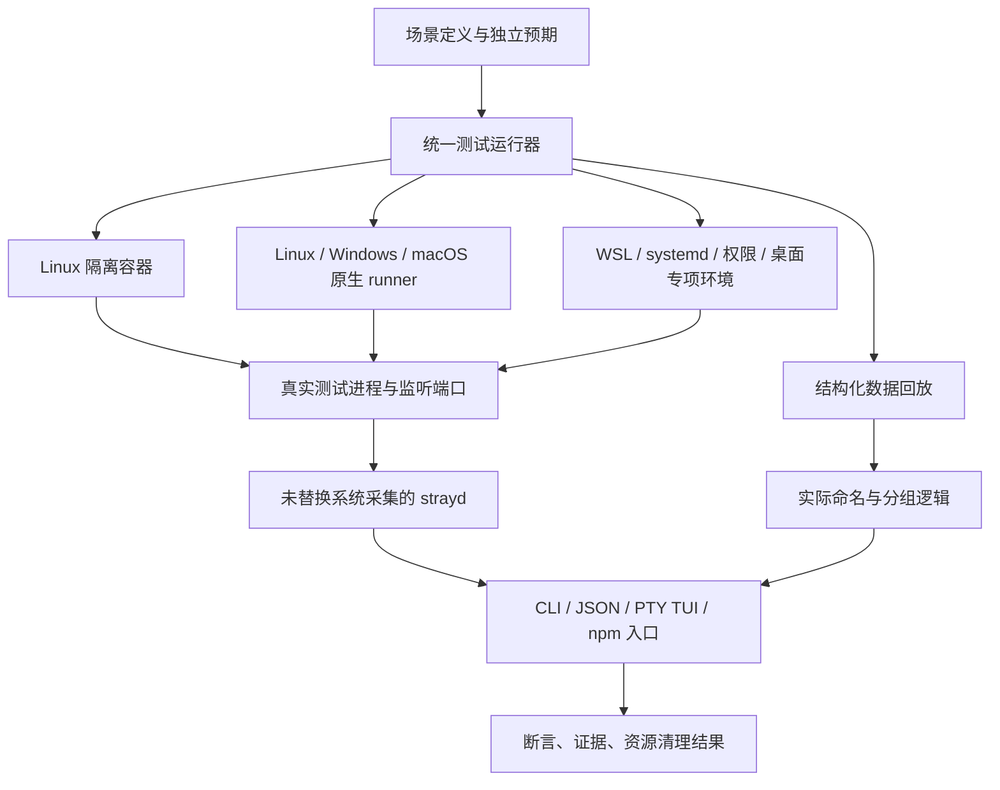

# Strayd 测试环境方案

基线：`7b86c26`，2026-09-08。本文定义目标环境、测试范围和落地验收条件；当前新增的是方案文档，下面标注为“拟新增”的环境、脚本和 CI 门禁尚未实现。

## 1. 要建立的能力

建立一套统一场景、统一入口、分平台执行、自动清理的测试环境，覆盖：

1. 命名、分类、分组和时间规则是否正确。
2. `sysinfo` / `netstat2` 在真实系统上实际取得了什么信息。
3. 从启动测试进程，到扫描、CLI/TUI 展示、停止、确认资源释放的完整过程。
4. 权限受限、进程退出、身份变化、系统命令失败等情况下的行为。
5. 用户安装 npm 包后，是否能调用对应平台的原生二进制。

“完备”以产品能力、平台和失败路径的覆盖矩阵为准，不以测试函数数量或行覆盖率为准。未知的操作系统版本、软件版本和自定义启动器必须在报告中体现验证边界。

### 当前基础与缺口

- 三个 Rust crate 已分别负责规则、系统采集/终止、CLI/TUI；现有 51 个测试函数主要验证规则和参数契约。
- 发布 workflow 已列出 Linux、Windows、macOS 的 x64/arm64 六种原生 runner，但只在版本 tag 或手动触发时运行，尚无 PR 门禁。
- 本次会话在 WSL2/Linux 上运行过临时真实进程与浏览器终端验收，但夹具和运行器没有持久化为可复用套件。
- macOS/Windows 路径用例属于输入模拟；不能证明这些系统上的进程采集正常。名称为 `cfuse` 的测试程序也不能证明真实 CodeFuse 正常。
- 当前本机为 WSL2，Docker 可用；这可以承担本地 WSL 与 Linux 容器执行，不具备已配置好的 macOS/Windows 原生测试环境。

## 2. 环境架构



容器适合隔离 Linux 进程、文件和网络；它与宿主共享内核，不能通过改路径或环境变量获得 macOS/Windows 的系统 API 行为。真正的平台测试使用对应系统的原生 runner 或虚拟机。[Docker 容器与虚拟机说明](https://docs.docker.com/get-started/docker-concepts/the-basics/what-is-a-container/)

| 环境 | 执行内容 | 不能据此宣称的覆盖 |
| --- | --- | --- |
| 任意开发机上的数据回放 | 命名、分类、关联、过滤、时间及缺失字段 | 对应平台的系统调用、权限和实际进程名 |
| Linux 容器 | 真实进程、端口、CLI、停止、资源回收；可重复构造账号与路径 | macOS、Windows、完整 systemd、其他 Linux 内核 |
| 三系统原生 runner | `sysinfo`、`netstat2`、真实运行时、信号/进程树、PTY、安装包 | 未运行的 OS 版本及桌面登录态 |
| 专项 VM/设备 | systemd、跨用户权限、WSL、桌面启动器与真实第三方应用 | 其他设备/软件版本自动等价 |

原生 runner 复用仓库已有六种标签：`ubuntu-24.04`、`ubuntu-24.04-arm`、`windows-2025`、`windows-11-arm`、`macos-15-intel`、`macos-15`。标签可用性按 GitHub 文档检查；每次报告仍记录实际镜像版本，不能把标签当成完全固定的环境。[GitHub-hosted runners](https://docs.github.com/en/actions/reference/runners/github-hosted-runners)

目前 README 没有声明最低 Windows/macOS/glibc 版本。第一版报告只承诺实际矩阵中的版本；最低版本兼容性必须另列基线，不能由“六架构构建成功”推导。

## 3. 统一场景与真实进程夹具

### 场景定义

每个场景描述自己的前置条件、启动方式、预期名称来源、端口/关系、允许的动作和清理要求。用以下三个标识区分证据：

- `synthetic`：手工构造的数据，覆盖规则边界。
- `native-fixture`：在真实系统上运行的自有测试程序或真实解释器。
- `real-app`：记录了实际版本和启动方式的第三方程序。

通过 `synthetic` 场景不能把同名 `real-app` 场景标记为通过。真实采集失败时，不允许切换到回放后继续汇报原生测试通过。

场景最少记录：`id`、支持平台、必需能力、数据来源、程序/运行时版本、启动参数数组、工作目录、预期名称与理由、预期分类/关系、动作、超时、验证方法。

例：`cfuse-home-proxy` 的预期是 `cfuse`，理由是普通程序名称应来自可执行文件，不应被主目录覆盖；`ai-coding-trace-bin` 的预期是 `ai-coding-trace`，理由是通用脚本入口所在的工具目录；这些预期写在场景中，不能调用生产命名函数生成。

### 真实进程夹具

新增一个仅用于测试的 Rust 小程序 `fixture-process`，在每个目标系统编译。它提供以下有限能力，不模拟业务软件内部功能：

- 监听一个或多个 IPv4/IPv6 TCP 端口，端口由 OS 动态分配。
- 创建父子进程、延迟子进程、主动退出；Unix 可选择处理或忽略 TERM。
- 通过控制管道发送 `ready`、实际 PID、实际绑定端口、子进程 PID 和退出事件。
- 在独立目录中复制为不同可执行文件名，测试长名称、空格、中文和路径差异。

同时用真实 Node/Bun/Deno/Python/Java/.NET 运行小型脚本、模块和 JAR，验证解释器自己的参数、进程标题与可执行文件映射。不能把同一个 Rust 程序改名为 `python` 后当作 Python 验收。

macOS 构造带 `Info.plist` 与可执行文件的最小 `.app`，分别测试直接执行和 LaunchServices 启动。Electron 辅助进程、CodeFuse、波点音乐另列 `real-app` 场景，使用真实应用或经脱敏的真实采集记录；缺少程序/桌面会话时明确为未验证。

### 就绪与预期的独立性

启动过程是“启动 → 收到 ready → 确认监听/存活 → 调用 strayd”，不使用固定睡眠猜测就绪，也不先占用端口后释放给夹具。

- PID 与端口以父进程拿到的 OS 子进程句柄、夹具实际绑定结果为依据。
- 创建时间以启动前后墙钟区间校验，考虑系统时间粒度；运行时长以单调时钟观察的间隔校验增量。
- 输出中的名称、分类、保护状态来自场景契约。不能拿同一个 `sysinfo` 查询结果与自身比较后宣称采集正确。
- OS 原生命令可作为诊断交叉证据，但不把易受语言影响的命令输出作为唯一判定依据。

## 4. 测试范围

| 能力 | 必测场景 | 主要环境与可观察结果 |
| --- | --- | --- |
| 进程命名 | 两种 cfuse 启动、用户主目录、bin/构建目录、`.app`、辅助进程、修改后的进程标题、解释器与模块、路径含空格/中文、缺失 exe/cwd/argv | 回放穷举规则；原生确认实际采集；真实软件验证其特有行为。名称和名称来源符合独立预期 |
| 分类 | README 声明的开发框架/隧道类型、普通监听程序、桌面应用、sshd | 每种声明的类型都有规则用例；代表性真实运行时在原生环境执行。普通监听程序仍可出现在“全部” |
| 端口扫描 | IPv4/IPv6、localhost/通配地址、单进程多端口、同端口多地址、无监听进程、扫描中退出、扫描器自身、权限不足 | 真实 socket/进程；结果只要求包含测试所属资源，不依赖宿主全局进程数量。UDP 不属于当前发现范围 |
| 分组关联 | 隧道与源端口匹配、独立隧道、多个隧道、跨平台相同端口、父子关系 | 规则回放与真实本地隧道；不会跨平台误关联，不丢独立资源 |
| 时间 | 秒/分/时/天边界、跨日时区、夏令时、未知/零/未来时间、扫描关闭后的持续递增 | 固定时钟规则测试 + 原生时间区间验证；不能修改宿主时钟制造边界 |
| 配置与 CLI | config init/show/path、优先级、损坏文件、无法写入、hide 组合、筛选、JSON、无匹配、多匹配、dry-run、取消、非 TTY | 调用实际二进制，校验退出码、语义输出、文件与进程状态；隔离配置路径 |
| 终止 | 普通进程、父子树、子进程先退出、TERM 无响应、目标消失、错误启动标识、跨平台请求、受保护资源、systemd unit | 原生/专项环境；指定测试对象消失或被拒绝，独立对照进程仍存活 |
| TUI | 中英文、80×24/100×18/132×40、窗口缩放、长命令、多进程详情、滚动、复制、切换后回顶、隐藏/设置、确认/取消、退出恢复 | PTY 跑真实 TUI；浏览器终端检查实际交互。复制完整，位置正确，终端模式恢复 |
| npm 分发 | 六个平台二进制映射、缺失文件、空格路径、参数与退出码透传、安装后 --version/list、TTY/信号透传 | 安装待发布 tgz 后从 npm 入口执行；不能只运行 Cargo 产物 |
| 稳定性 | 场景串行/并行、重复启动停止、多个同名进程、较多监听端口、失败与中断清理 | 验证结果不依赖排序或固定 PID/端口，资源无泄漏；性能记录使用固定负载 |

真实隧道优先连接本地测试端点。例如在隔离环境启动临时 SSH 服务并执行本地反向转发。必须依赖公网服务的集成另列定时检查，不能让 PR 的基本发现/分组验收依赖公网可用性。

PID 复用不靠循环创建海量进程碰运气：规则层覆盖“同 PID、不同启动标识”；原生层对自己创建的存活进程提交错误启动标识并确认被拒绝且进程仍活着。真正的 PID 复用竞态另列压力专项，不把前两者描述为已经复现了内核 PID 复用。

## 5. 各环境如何构建

### 本地 Linux 容器

- 测试镜像包含固定版本的 Rust、Bun、Node、Python 与必要运行库，镜像按 digest 固定；Java/.NET 等扩展运行时放入扩展镜像，避免所有场景都付安装成本。
- 在镜像内构建并运行 strayd，避免把宿主高版本 glibc 的二进制直接放进低版本镜像。
- strayd、测试进程与本地隧道必须位于可相互发现的同一 PID/网络环境；默认放在同一测试容器中。
- 默认使用非 root 用户、容器私有 PID/网络命名空间，不挂宿主 `/proc`、Docker socket，不使用 host PID/network 或 privileged 模式。
- 文件输入只读挂载或复制；构建缓存与证据使用任务专属目录。普通扫描/终止用例不发布宿主端口。
- 普通用例可关闭外网；需要测试内部服务互联时使用任务专属网络。拉取依赖发生在镜像准备阶段。
- 新建临时账号的权限场景在专用容器/VM 内准备，运行被测 strayd 时使用所要求的权限身份。

### 原生平台与专项环境

- Linux/Windows/macOS 的共同场景使用相同场景定义，在该系统原生编译夹具与 strayd。
- Windows 重点检查真实参数获取、标准用户/管理员差异、`taskkill /T /F`、ConPTY、目录被占用时的清理。
- macOS 重点检查 `.app`、LaunchServices、辅助进程、权限受限、ARM/Intel 和进程标题；GUI 场景若缺桌面会话，交给有登录态的专用测试设备。
- systemd 的发现和 stop 路径在启动了 systemd 的一次性 VM 中运行，创建任务专属 unit；普通 Docker 场景不承担这项证明。
- WSL2 独立作为执行环境，验证只发现 Linux 侧对象，不混入 Windows 侧同端口进程。现有 WSL 本机可跑开发者自测；持续门禁需要可重建的专用 Windows/WSL runner。
- 专项 runner 的账号和服务属于测试环境，不能让测试连接到开发者正在工作的 SSH 服务或业务机器。

## 6. Mock 与生产代码边界

保留现有原生采集入口。真实集成测试不替换 `sysinfo`、`netstat2` 或系统终止命令。

为了回放复杂边界，允许按需要做两处有限提取：

1. 把系统采集得到的进程/监听数据到 `ScanSnapshot` 的转换提成可接收数据的函数。采集函数和回放读取器调用同一转换逻辑；真实采集测试仍从最外层进入。
2. 让时间格式化/详情内容生成接收明确的当前时间，以确定性方式测试跨天和时区；真实 TUI 继续使用真实时钟。

不增加生产 `--mock-os` 开关或环境变量后门。回放使用测试程序，涉及 stop/open 等动作一律记录或拒绝，不能让录制文件里的 PID 触发真实系统操作。动作是否真正有效仍由原生测试验证。

录制数据标记 `synthetic` 或 `captured`，保存 OS、架构、采集器/应用版本、采集日期、字段缺失原因与脱敏规则。优先只采集本次测试所属 PID；真实用户案例移除 token、账号路径和私有命令参数，同时保留影响判断的路径结构及参数边界。

## 7. 实现工具与文件组织

复用现有 Cargo 测试和 Bun 脚本。只引入完成缺失能力所需的测试依赖：

- CLI 调用使用 `assert_cmd`，支持真实进程的参数、环境、退出码与超时断言。[assert_cmd 文档](https://docs.rs/assert_cmd/latest/assert_cmd/)
- 临时目录使用 `tempfile`；它的目录清理依赖析构，因此还必须有运行器的中断/失败清理。[tempfile 文档](https://docs.rs/tempfile/latest/tempfile/)
- 跨平台终端使用 `portable-pty`，避免维护三套 PTY 接线；终端行为以实际平台运行结果为准。[portable-pty 文档](https://docs.rs/portable-pty/latest/portable_pty/)
- 确定性布局可用已依赖 Ratatui 的 `TestBackend` 检查关键可见区域与点击范围，不建立锁定整屏文案的快照库。[TestBackend 文档](https://docs.rs/ratatui/latest/ratatui/backend/struct.TestBackend.html)
- 浏览器视觉和交互验收继续从 `browser-harness` 进入；xterm 仅承载真实 PTY，不重绘一份仿 TUI 页面。

拟新增结构：

```text
tests/
  scenarios/                 # 场景与独立预期
  recordings/                # 脱敏后的平台采集记录
  apps/                      # 最小脚本、模块、应用包素材
  environments/linux/        # 固定依赖的 Dockerfile
  environments/special/      # systemd / WSL 等环境准备说明
crates/strayd-test-support/   # 不发布：真实进程夹具、生命周期管理、PTY 支持
crates/port-deck-engine/tests/native_contract.rs
crates/port-deck-cli/tests/cli_journey.rs
crates/port-deck-cli/tests/tui_journey.rs
scripts/test-env.ts          # 薄调度：预检、构建、执行、采证、清理
.github/workflows/test.yml   # PR / 主分支门禁
.github/workflows/extended-test.yml
```

Rust 支持包负责进程生命周期和跨平台差异；Bun 脚本只调度已有测试、容器与采证工具，不另写一套断言引擎。支持包不进入 npm 产物。

拟新增命令契约，当前尚不可执行：

```bash
# 快速规则检查：沿用已存在的命令
bun run test
bun run check

# 以下为方案中的未来入口
bun scripts/test-env.ts run --profile linux-container --suite smoke
bun scripts/test-env.ts run --profile native --suite native
bun scripts/test-env.ts run --profile native --suite tui
bun scripts/test-env.ts run --profile replay --scenario cfuse-home-proxy
bun scripts/test-env.ts run --profile native --suite package --artifact <tgz>
bun scripts/test-env.ts run --profile systemd-vm --suite lifecycle
bun scripts/test-env.ts cleanup --run <run-id>
```

同一命令只能运行宿主或所选后端实际拥有的系统。Linux 上请求 macOS 原生场景应报告缺少对应 runner，不能自动降级为 macOS 数据回放。

## 8. CI 与发布门禁

| 时机 | 必跑范围 | 通过要求 |
| --- | --- | --- |
| 本地开发 | 受影响规则、当前平台 native smoke；TUI 改动做 PTY/浏览器验收 | 相关场景与清理通过 |
| PR / 主分支 | 格式、Clippy、规则；Linux x64、Windows x64、macOS arm64 原生 smoke 与 CLI；PTY 基本交互 | 三系统均通过，必测能力缺失不能标绿 |
| TUI 相关 PR | 上述检查 + 浏览器终端交互、窗口尺寸与中英文布局 | 复制、滚动、确认和退出恢复均有证据 |
| 每日扩展 | 六架构 native、解释器矩阵、重复生命周期、WSL/systemd/权限/桌面专项 | 分项记录失败与未覆盖；核心回归阻止发布 |
| 发布 tag | 六架构构建与原生测试；装箱后再在六种平台安装同一个 tgz 验证 npm 入口 | 实际打包产物通过；不能用打包前结果替代 |

已有 `build-npm.yml` 的装箱任务之后应增加安装包验证矩阵。PR 不执行公网隧道或需要第三方账号的检查；此类检查有独立结果，不能影响基本离线套件的确定性。

普通原生 job 不需要自行维护长期虚拟机。WSL、systemd、桌面和跨权限能力无法由普通 job 满足时，使用独立环境；在其尚未接入前，报告标记“未覆盖”，不能把完整环境方案称为全部落地。

运行时、Rust 与测试依赖使用锁定版本；镜像更新通过单独变更跑矩阵。PR 优先跑三系统常见组合，六架构与扩展运行时放在定时/发布阶段，避免无意义地穷举所有组合。OS 专有差异不得因为“组合缩减”被删除。

## 9. 生命周期、失败反馈与证据

每次运行生成唯一 run ID，记录所属 PID/启动身份、进程句柄、容器 ID、端口、临时目录、unit、浏览器 profile 和 PTY。命名只用于查看，清理以实际句柄/身份为准。

测试 stop 前确认目标属于本次夹具；额外保留一个对照进程，验证它没有被误停。清理不依赖被测 `strayd stop`，由测试运行器独立回收，即使产品停止逻辑失效也能结束测试。

清理顺序为关闭交互客户端 → 终止夹具进程树并等待回收 → 删除任务 unit/容器/网络 → 删除临时配置和目录 → 确认端口、浏览器、PTY 与验证进程释放。Windows 等待文件句柄关闭后再删目录；Unix 回收子进程，避免留下僵尸。

正常结束、断言失败、超时、Ctrl+C 和 CI 取消都进入清理。RAII 与 `finally` 是第一层；运行器强制退出时由外层 job 的 always-cleanup 或一次性环境销毁兜底。不得用宽泛 `pkill`、`taskkill /IM` 或全局 Docker prune 清理。

报告按场景记录：

- commit、产物摘要、场景来源、OS/内核/架构、权限、依赖版本、镜像版本。
- `pass` / `fail` / `blocked` / `not-applicable`，后两者必须给理由；必测场景缺能力时整体不通过。
- 预期、实际结果、脱敏的扫描 JSON、测试进程事件、CLI 退出码、有限的 stdout/stderr。
- TUI 的窗口尺寸、语言、PTY 交互记录；浏览器验收的实际 APP_URL、截图、控制台/网络错误。
- 每项资源的清理结果；清理失败即本次运行失败。

证据写入忽略目录并在 CI 上传 artifact，不提交原始主机进程转储。失败优先保留相关夹具证据；默认不保留运行中的测试环境。基础设施故障与产品断言失败分开报告，不能通过无限重试把失败冲成绿色。

## 10. 落地顺序与完成标准

1. **真实进程基础**：持久化 fixture-process、进程登记/清理、native smoke 和 Linux 容器入口。验收为 cfuse/工具目录案例从真实启动到扫描、停止和端口释放闭环，并验证超时清理。
2. **三系统持续运行**：接入 PR 原生矩阵，实际跑 macOS 应用包、Windows 进程树、Linux 标题/路径等差异。验收为三系统报告中的采集链路均未被 mock。
3. **交互与分发**：持久化 PTY 与 browser-harness 路径，补上配置/CLI 和 tgz 安装后的验证。验收为六架构打包产物通过，以及滚动、复制、取消、终端恢复通过。
4. **故障与专项**：接入回放记录、跨权限、systemd、WSL、真实第三方应用及重复生命周期测试。真实 CodeFuse/波点音乐缺少安装环境时仍明确保留缺口。

最终验收不只看 happy path：故意使夹具启动失败、测试超时、某个依赖不可用、一个场景断言失败，运行器都应给出准确失败原因并完成清理；同时确认测试辅助程序和录制模式未进入发布包。

完成后开发者应能用一个入口复现场景，CI 能定位失败发生在哪个系统/层次，报告能明确区分“规则正确”“原生链路正确”和“真实应用已验证”。
